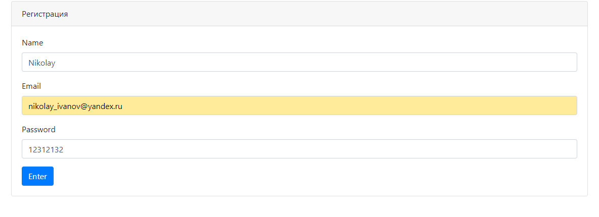

# Проект "Работа мечты"

* [Описание](#описание)
* [Функционал](#функционал)
* [Технологии](#технологии)
* [Архитектура](#архитектура)
* [Интерфейс](#интерфейс)
* [Документация JavaDoc](#javadoc)
* [Тесты](#тесты)
* [Автор](#автор)
* [Критика и предложения](#критика_и_предложения)

## Описание
CRUD-MVC приложение на сервлетах и JSP, реализующее простую биржу
вакансий и кандидатов.
Можно добавлять/изменять данные по каждой вакансии и кандидату.
По кандидатам так же поддерживается хранение фотографии.
## Функционал
* Регистрация пользователя
* Аутентификация на сервлет-фильтрах
* Авторизация через БД PostgreSQL
* Добавление/изменение вакансий
* Добавление/изменение соискателей
* Добавление/изменение/скачивание фотографии соискателя

## Технологии
* Java14
* JDBC
* PostgreSQL
* Servlet&JSP&JSTL
* HTML, CSS, BOOTSTRAP, JS, AJAX, JQUERY
* Apache Tomcat Server
* Junit, Hamcrest, Mockito, Powermock
* Log4j, Slf4j
* Apache Commons Fileupload

## Архитектура

Проект реализован по шаблону MVC и разделён на слои:
1. Хранилища(Model)

    1.1 [PsqlPostStore](src/main/java/ru/job4j/dream/store/PsqlPostStore.java) - 
    PostgreSQL хранилище для вакансий  
    1.2 [PsqlCandidateStore](src/main/java/ru/job4j/dream/store/PsqlCandidateStore.java) - 
    PostgreSQL хранилище вакансий
2. JSP - View
    
    2.1 [index.jsp](src/main/webapp/index.jsp) - главная страница приложения.
    На ней отображаются все вакансии и кандидаты, добавленные за последние сутки.
    А так же, меню.
    2.2 [posts.jsp](src/main/webapp/posts.jsp) - страница, содержащая список вакансий. 
    У каждой вакансии есть ссылка на редактирование.
    2.3 [candidates.jsp](src/main/webapp/candidates.jsp) - аналогично страница с кандидатами
    2.5 [auth.jsp](src/main/webapp/auth.jsp) - страница авторизации
    2.6 [reg.jsp](src/main/webapp/reg.jsp) - страница регистрации
    2.7 [upload.jsp](src/main/webapp/upload.jsp) - страница загрузки фотографии кандидата
3. Сервлеты - Controller
    
    3.1 [AuthServlet](src/main/java/ru/job4j/dream/servlet/AuthServlet.java) - 
    Сервлет авторизации. Принимает запрос с JSP, производит валидацию введённых
    пользователем данных, существует ли в PostgreSQL хранилище такой пользователь. В случае успешной авторизации, добавляет
    пользователя в Http-сессию.   
    3.2 [RegServlet](src/main/java/ru/job4j/dream/servlet/RegServlet.java) - 
    Сервлет регистрации. Принимает запрос с JSP, производит валидацию. В случае успешной
    регистрации добавляет нового пользователя в PostgreSQL- хранилище и в Http-сессию, производит
    авторизацию.   
    3.3 [IndexServlet](src/main/java/ru/job4j/dream/servlet/IndexServlet.java) - 
    Сервлет отвечает за отправку данных на главную страницу приложения.
    В частности, списки сегодняшних вакансий и кандидатов.   
    3.4 [PostServlet](src/main/java/ru/job4j/dream/servlet/PostServlet.java) - 
    Сервлет отвечает за загрузку списка всех вакансий на соответствующую JSP-страницу   
    3.5 [CandidateServlet](src/main/java/ru/job4j/dream/servlet/CandidateServlet.java) - 
    Сервлет отвечает за загрузку списка всех кандидатов на соответствующую JSP-страницу   
    3.6 [DownloadServlet](src/main/java/ru/job4j/dream/servlet/DownloadServlet.java) - 
    Сервлет отвечает за загрузку изображения на страницу, и скачивание его пользователем.    
    3.7 [UploadServlet](src/main/java/ru/job4j/dream/servlet/UploadServlet.java) - 
    Сервлет отвечает за загрузку пользователем фотографии для определённого кандидата.  
4. Фильтры
    4.1 [AuthFilter](src/main/java/ru/job4j/dream/filter/AuthFilter.java) - 
    Блокирует доступ неавторизованному пользователю ко всем страницами приложения,
    кроме страниц авторизации и регистрации.
    4.2 [CorsFilter](src/main/java/ru/job4j/dream/filter/CorsFilter.java) - 
    Cross-Origin-Resource-Sharing фильтр. Допускает междоменные запросы, когда
    клиент и сервер находятся на разных машинах.
     
## Интерфейс
1. Регистрация.

    1.1 Зарегистрируемся.
    
    1.2 Попробуем ещё раз зарегистрироваться с этими же данными.
     

2. Авторизация.

    2.1 Попробуем авторизоваться с несуществующим e-mail
    
    
    2.2 Попробуем авторизоваться с неверным паролем
    
    
    2.3 Авторизуемся с верными данными
    
    
3. Вакансии.
    
    3.1 Как видим, уже добавлено несколько вакансий
    
    3.2 Отредактируем первую
    
    
    
    
    
    
    
    3.3 Добавим новую вакансию.
    
    
    
    
4. Кандидаты     
    
## JavaDoc
TODO

## Тесты
На сервлеты написаны тесты с 
применением технологий Mockito и Powermock:
* [PostServletTest](src/test/java/ru/job4j/dream/servlet/PostServletTest.java) - 
тесты на PostServlet
* [CandidateServletTest](src/test/java/ru/job4j/dream/servlet/CandidateServletTest.java) - 
тесты на CandidateServlet

## Автор

Гераськин Егор Владимирович

Java-разработчик

yegeraskin13@gmail.com

+79271506651

## Критика_и_предложения
Все замечания и пожелания по этому проекту просьба направлять мне 
на электронный адрес: yegeraskin13@gmail.com